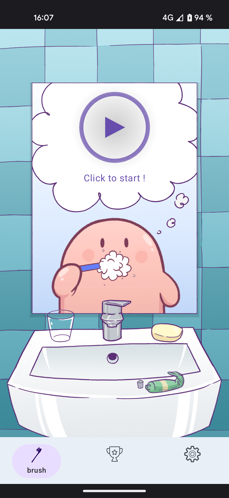
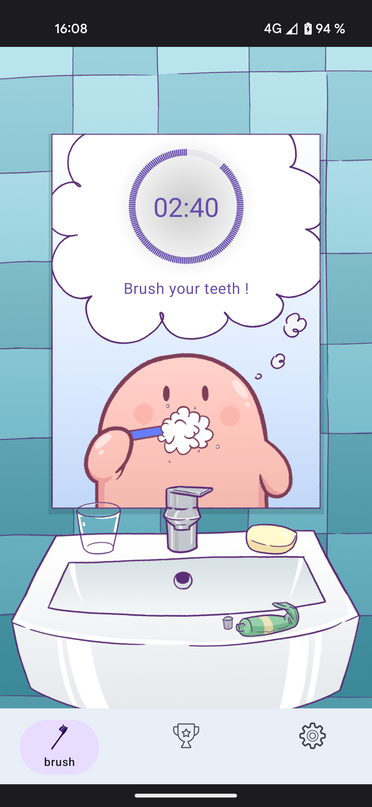
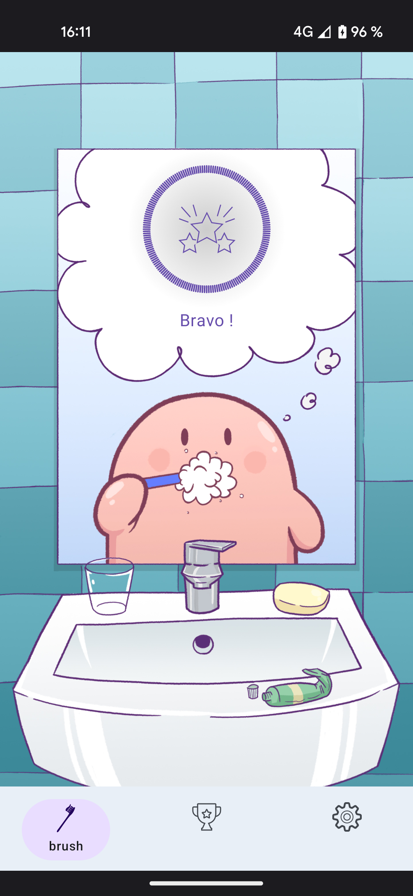
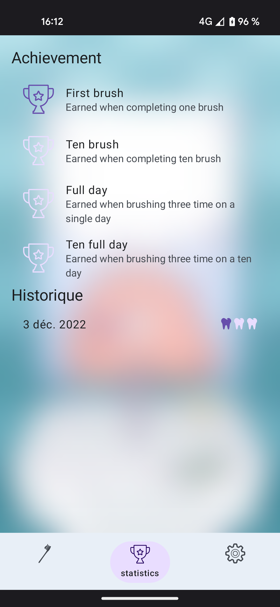
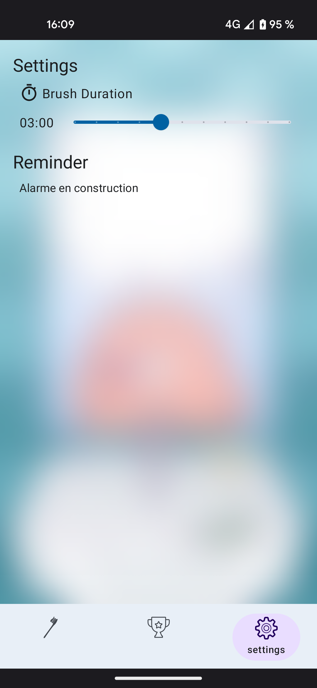

#  PipouBrushApp

## App Feature
- Display a timer for brush duration
- Display a brush history with brush count per day
- Display an achievement list.
- Permit to change the brush duration
- Permit to setup a reminder alarm and/or notification

## Setup
1. In your terminal : Clone this repo with : 
```sh
git clone git@github.com:Illiouchine/PipouBrushApp.git
```
2. Initialises submodules with :
```sh
git submodule update --init --recursive
```
3. Open the project in Android Studio
4. Do a gradle sync
5. Now you should be able to build and deploy
6. Enjoy <3

## Submodules
This project use the MVI (Model View Intent) architecture and use a custom mvi library : 
[https://github.com/Illiouchine/mvi-library](https://github.com/Illiouchine/mvi-library)

## Used Libraries
- Mvi architecture with [mvi-library](https://github.com/Illiouchine/mvi-library)
- Ui Rendering with [compose](https://developer.android.com/jetpack/compose)
- Ui Design with [compose-material3](https://developer.android.com/jetpack/androidx/releases/compose-material3?hl=en)
- Data Storage with [room](https://developer.android.com/training/data-storage/room)
- Dependencies injection with [hilt-android](https://developer.android.com/training/dependency-injection/hilt-android)
- Testing with [mockito](https://developer.android.com/training/testing/local-tests)
- Asynchronous with [Coroutine and Flow](https://developer.android.com/kotlin/flow)

## Thanks
- For the assets of Pipou thanks to krogogo : follow him on [instagram](https://www.instagram.com/krogogo/)

## TODO
- [x] user can start a 3:00 countdown
- [x] user can reset countdown to 3:00
- [x] make the countdown prettier
- [x] make total countdown dynamic
- [x] count the number of use to anticipate achievement
- [x] save Brush Duration in shared pref
- [x] setup achievement ? 
- [x] Setup I18n : en / fr
- [x] Add Thanks section
- [x] Give feedback when earning achievement
- [x] setup reminder of brushing 
- [ ] Setup PlayStore and CD/CI
- [ ] setup Mini game when brushing
- [ ] Manage external link in Thanks section : https://www.instagram.com/krogogo/
- [ ] Make the statistic and achievement section size dynamic 

## Know issue
- [ ] Remove blur effect on api lower than 11
- [ ] Fix accessibility issue reported by the play console
- [ ] Lock screen pause the timer
- [ ] Fix timer positioning on other device

## Join Pipou Tester
- on Android [https://play.google.com/store/apps/details?id=com.illiouchine.toothbrush](https://play.google.com/store/apps/details?id=com.illiouchine.toothbrush)
- on Web [https://play.google.com/apps/testing/com.illiouchine.toothbrush](https://play.google.com/apps/testing/com.illiouchine.toothbrush)

## Screenshots
### Timer screen



### Statistics screen

### Settings screen (update required)


